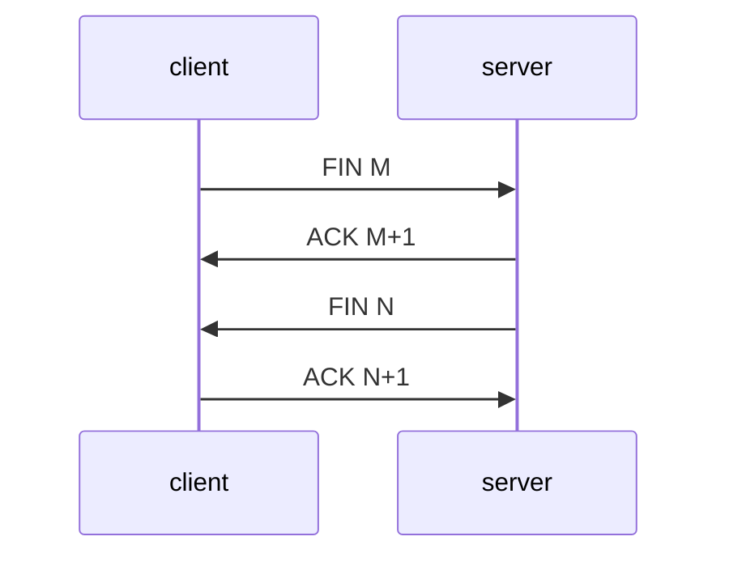

# Многопоточное программирование на С/С++

Краткий конспект курса [Многопоточное программирование на С/С++](https://stepik.org/course/149/syllabus) на платформе Stepik.

## Аллокаторы

Аллокаторы - средсва для работы с памятью
аллокатор для вектора (stl): 
```C++ 
std::vector<int, std::allocator<int>> v(16); 
```
Intel TBB - аллокатор библиотеки для параллельного программирования

простой CMake:
```CMake
all:
	gcc -o leak leak.c
```

```leak``` - название проекта
```leak.c``` - название файла

Иногда нужно указать стандарт языка: -std=c99

```gcc -std=c99 -o leak leak.c```

аллокатор ```dmalloc``` - для работы с памятью (напр. поиск утечек) (утилита dmalloc)

```$ dmalloc -d 0 -l leak.log -p log-non-free```

```-d 0 ``` - сброс предыдущих настроек

```-l leak.log ``` - указываем файл, куда писать вывод

``` -p log-non-free ``` - опции, что ищем аллокатором (память выделена, но не освобождена)

```$ eval `dmalloc -d 0 -l leak.log -p log-non-free` ``` - устанавливаем переменные

Добавляем в программу ```<dmalloc.h>```, добавляем в CMake "-ldmalloc:"
```CMake
all:
	gcc -o leak leak.c -ldmalloc 
```
	
```tcmalloc``` - Аллокатор от Google (показывает хорошие результаты на многопоточных программах)

```jemalloc``` - стандартный аллокатор системы FreeBSD, по функциональности и производительности похож на tcmalloc, в системах Linux выполнен в виде отдельной библиотеки.

Алгоритмы уплотнения памяти:
1. Алгоритм Бейкера

Разделяет память пополам. Периодически копирует данные из одной половины в другую так, чтобы они шли друг за другом, следовательно в памяти не остается незанятых "дыр". Указатели на выделяемые объекты должны быть умными.
Достоинства: не блокируем объекты, какая-то из копий объекта всегда доступна.

2. Уплотнение на месте

Каждый объект двигаем максимально "вверх", чтобы данные находились вплотную друг к другу.

## Сокеты Беркли, мультиплексирование

**Сокет** (англ. _socket_ — разъём) — название программного интерфейса для обеспечения обмена данными между процессами. Процессы при таком обмене могут исполняться как на одной ЭВМ, так и на различных ЭВМ, связанных между собой сетью. Сокет — абстрактный объект, представляющий конечную точку соединения.

**Сокеты Беркли** — интерфейс программирования приложений (API), представляющий собой библиотеку для разработки приложений на языке C с поддержкой межпроцессного взаимодействия (IPC), часто применяемый в компьютерных сетях.

**Сокет домена Unix** (англ. _Unix domain socket_, UDS) или **IPC-сокет** (сокет межпроцессного взаимодействия) — конечная точка обмена данными, подобная Интернет-сокету, но не использующая сетевого протокола для взаимодействия (обмена данными). Используется в операционных системах, поддерживающих стандарт POSIX, для межпроцессного взаимодействия.

### Создание сокета

Сокет создается следующим системным вызовом: 
```C++
int s = socket(domain, type, protocol)
```

где ```s``` - дескриптор сокета.

>_Дескриптор_ - указатель на сущность сокета ядра (пример: ```int f = open(...)```, ```f``` - дескриптор).

В качестве параметра ```domain``` указывается одна из следующих констант:
- ```AF_INET``` - работа с IPv4
- ```AF_INET6``` - работа с IPv6
- ```AF_UNIX``` - создание UNIX-сокета

Константы ```type```:
- ```SOCK_STREAM``` - работа по протоколу TCP
- ```SOCK_DGRAM``` - работа с datagram по протоколу UDP

Константы ```protocol``` :
- ```0``` - протокол по умолчанию
- ```IPPROTO_TCP``` - явное указание протокола TCP
- ```IPPROTO_UDP``` - явное указание протокола UDP

### Привязка сокета

После создания сокета необходимо его привязать к IP-адресу и порту. Для сервера указывается собственный IP сервера, для клиента - IP сервера):
```C++
bind(s, (struct sockaddr *)sa, sizeof(sa))
```
### Привязка сокета к адресу и порту

Для привязки **сокета** **IPv4** IP-адресу и порту, необходимо использовать следующую структуру:
```C++
struct  sockaddr_in sa;
sa.sin_family = AF_INET;
sa.sin_port = htnos(12345); // функция htnos() приводит байты в нужный порядок, чтобы порт был распознан правильно
sa.sin_addr.s_addr = htonl(address); // htonl() выполняет функцию, аналогичную htnos()
```	
где в качестве ```address``` может быть указана одна из следующих констант:

```INADDR_LOOPBACK``` - 127.0.0.1, может подключиться только клиент, запущенный на той же машине, внутренний адрес

```INADDR_ANY``` - 0.0.0.0, открываем сокет на все доступные адреса

Для приведения строки к формату IP-адреса можно использовать:
```inet_addr("10.0.0.1") ``` - устаревшая, возвращает число???, нельзя применить к IPv6

```inet_pton(AF_INET, "10.0.0.1", &(sa.sin_addr))```

Для привязки **сокета** **IPv6** IP-адресу и порту используется структура ```sockaddr_in6```. [RTFM](https://ru.manpages.org/ipv6/7). 

Для **UNIX-сокетов**:

```C++
struct sockaddr_un sa;
sa.sun_family = AF_UNIX;
strcpy(sa.sun_path, "/tmp/a.sock"); // "/tmp/a.sock" - путь к файлу сокета, хорошая практика - создавать сокеты в папке /tmp
```

### Прослушка сокета

Для прослушки сокета необходимо вызвать:
 ```C++
 listen(s, SOMAYCONN);
 ```

 где ```SOMAYCONN``` - максимальная длина очереди соединений, за раз принимается одно соединение, остальные встают в очередь, обычно ```SOMAYCONN = 128```.

После установки сокета в состояние прослушки, необходимо начать принимать соединения:

```C++
while (s1 = accept(s, 0, 0)) { /* обработка */ }
```
где:

```s1``` - дескриптор нового сокета;

```0``` - ```struct sockaddr *```, IP-адрес и порт;

```0``` - ```size *```, размер структуры.

Значения ```0``` и ```0``` - игнорирование информации о ```domain``` и ```port``` клиента.

Для чтения и записи сокетов используются функции:
```C++
size_t read(int fd, void *buf, size_t count); // чтение
```
```C++
size_t write(int fd, const void *buf, size_t count); // запись
```

где ```fd``` - файловый дескриптор, ```*buf``` - буфер, в который проводится чтение, ```count``` - размер буфера.

При попытке записи или чтения сокета, соединение с которым прервано, будет получен сигнал ```SIGPIPE```, при получении которого обработчик сигналов по умолчанию остановит приложение.
Справиться с этим можно следующими способами, проигнорировав сигнал (плохой способ):
```signal(SIGPIPE, SIG_IGN)```

Более правильный способ заключается в использовании следующих функций:

```C++
ssize_t recv(int fd, void *buf, size_t count, int flags); // чтение
```
```C++
ssize_t send(int fd, const void *buf, size_t count, int flags); // запись
```
где в качестве ```flags``` указывается ```MSG_NOSIGNAL```, который позволяет решить проблему.

### Соединение по TCP

Производится следующей функцией:

```C++
int connect(int sockfd, const struct sockaddr *addr, socklen_t addrlen);
```

Вызывается на клиентском сокете, запускает процесс соединения с сервером. Адрес сервера передается через ```addr``` и ```addrlen```.

### Установка соединения TCP

|№| Сервер 		| Клиент	| Комментарий
|-| -		 	| -		 	| -				
|1| socket() 	| socket() 	| Создаем сокеты на сервере и клиенте
|2| bind() 		| -			| 
|3| listen() 	| - 		|
|3| - 			| connect() | Присоединение клиента к серверу: клиент отправляет на сервер пакет с флагом ```SYN``` и произвольным числом ```J```
|4| accept() 	| -			| Возвращает клиенту флаг ```SYN``` с произвольным числом ```K``` и флаг ```ACK``` с числом ```J+1```
|5| -		 	| -			| Клиент возвращает пакет с ```ACK``` и числом ```K+1```

```3```, ```4``` и ```5``` - **тройное рукопожатие**.

Далее считается, что соединение установлено и продолжается выполнение (команды ```send()``` и ```recv()```)

### Закрытие соединения

Закрыть соединение может как сервер, так и клиент.

Закрыть соединение можно функцией ```close(s)```, при этом закроется дескриптор, но соединение **не разорвется**. Для закрытия соединения необходимо вызвать:
```C++
shutdown(s, how);
close(s);
```
где в качестве параметра ```how``` используется одно из следующих значений:

```SHUT_RD``` - закрытие на чтение;

```SHUT_WR``` - закрытие на запись;

```SHUT_RDWR``` - полное закрытие.

Разрыв TCP-соединения происходит следующим образом (один из сценариев):



### Передача дейтаграм (UDP)

В UDP нет четкого понятия *клиент* и *сервер*, поскольку при передачи дейтаграм друг другу оба агента выступают и в качестве клиента, и в качестве сервера.

Передачу одной дейтаграммы можно представить следующим образом:

|№| Сервер 		| Клиент	| 
|-| -		 	| -		 	| 			
|1| socket() 	| socket() 	| 
|2| bind() 		| -			| 
|3| recvfrom() 	| - 		|
|3| - 			| sendto()  | 

```C++
ssize_t sendto(int sockfd, // сокет
			  const void *buf, // сокет
			  size_t len, // длина буфера
			  int flags, // флаги
			  struct sockaddr *dest_addr, // адрес получателя
			  socklen_t addrlen // длина адреса
			  );
```

```C++
ssize_t recvfrom(int sockfd, // сокет
				 void *buf, // буфер с данными
				 size_t len, // длина буфера
				 int flags, // флаги
				 struct sockaddr *src_addr, // адрес получателя
				 socklen_t *addrlen // длина адреса
				 ); 
```

Подробнее на [сайте](https://ru.manpages.org/recvfrom/2).

>**576 байт** - гарантированный размер неделимой дейтаграммы.

### Перевод сокета в неблокирующий режим

При попытке чтения/записи **блокирующего сокета** соответствующая функция будет ждать до тех пор, пока не прочитает хотя бы один байт или произойдет разрыв соединения или придет сигнал.

В случае **неблокирующих сокетов** функция чтения проверяет, есть ли данные в буфере, и если есть - сразу возвращает, если нет, то она не ждет и также сразу возвращает, что прочитано 0 байт.

>По умолчанию все сокеты блокирующие.

Перевод сокета в неблокирующий режим проводится следующей функцией:
```C++
int set_nonblock(int fd) {
    int flags;
#if defined(O_NONBLOCK)
    if ((flags = fcntl(fd, F_GETFL, 0)) == -1)
        flags = 0;
    return fcntl(fd, F_SETFL, flags | O_NONBLOCK);
#else
    flags = 1;
    return ioctl(fd, FIOBIO, &flags);
#endif
} 
```

>Макрос ```O_NONBLOCK``` используется для определения текущей операционной системы, поскольку от этого зависит способ перевода сокета в неблокирующий режим.

### Опции сокетов

Установка опции повторного использования:
```C++
int optval = 1;
setsockopt(s, SOL_SOCKET, SO_REUSEADDR, &optval, sizeof(optval));
```

Установка таймаута на чтение/запись:
```C++
struct timeval tv;
tv.tv_sec = 16;
tv.tv_usec = 0;
setsockopt(s, SOL_SOCKET, opt, (char *)&tv, sizeof(tv));
```
В качестве ```opt``` используется ```RCVTIMEO``` или ```SNDTIMEO```.

### Пример

Пример программ клиента и сервера добавлен в папку "../TCP_ClientServer" (нужно протестировать)

Видео по примеру с комментариями доступно по [ссылке](https://stepik.org/lesson/12576/step/12?unit=3004).

### Литература

Немного о сокетах:
- https://en.wikipedia.org/wiki/Berkeley_sockets

И о протоколах:

- https://en.wikipedia.org/wiki/Internet_Protocol

- https://en.wikipedia.org/wiki/IPv4

- https://en.wikipedia.org/wiki/IPv6

- https://en.wikipedia.org/wiki/Transmission_Control_Protocol
- https://en.wikipedia.org/wiki/User_Datagram_Protocol

Тем, кому интересна более серьезная литература:
- https://tools.ietf.org/html/rfc791
- https://tools.ietf.org/html/rfc3513
- https://en.wikipedia.org/wiki/Transmission_Control_Protocol#RFC
- https://en.wikipedia.org/wiki/User_Datagram_Protocol#RFC_references


